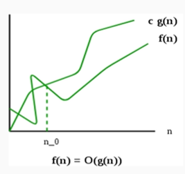
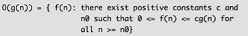
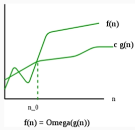
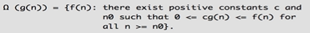
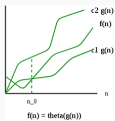
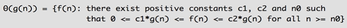

# Asymptotic Analysis
1. Tool to describe time complexity of an algorithm.
2. Provide Mathematical models.
3. As a function of input size independent of architecture and language.
4. compare various algorithms for same probles.

## Asymptotic Notation
1. Big-Oh (O) notation: Denote upper bound of an algorithm.Worst case analysis.

2. Omega Notation: Denote Lower bound of an algorithm. Best case analysis.

3. Theta Notation: Exact asymptotic behavior.Average case analysis.

# Tuple
1. tuple as list collection of an heterogeneous objects.
2. tuple are immutable.
3. In tupe we use curly parentheses. 
4. It represent as ().

# dictionary
1. Dictionary are very useful data structure in python there are also known as associative arrays.
2. Dictionary are essentialy mutable key value pair.
3. Tuple can be keys, list can't be keys, values can be mutable or immutable.
4. It represent as {}.

# Sets
1. Sets is a collection of immutable objects which are unorder and unique.
2. Sets itself can be mutable.
3. It represent as {}.

# Data Structure and Algorithms

## Divide and Conquer 

## Recursion 
